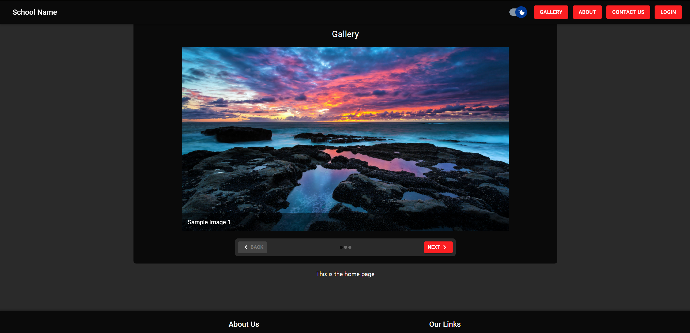
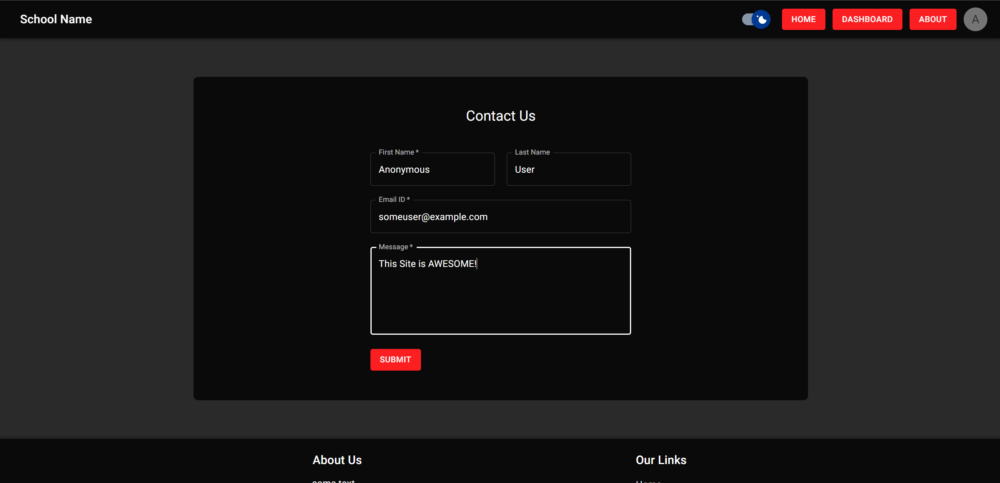
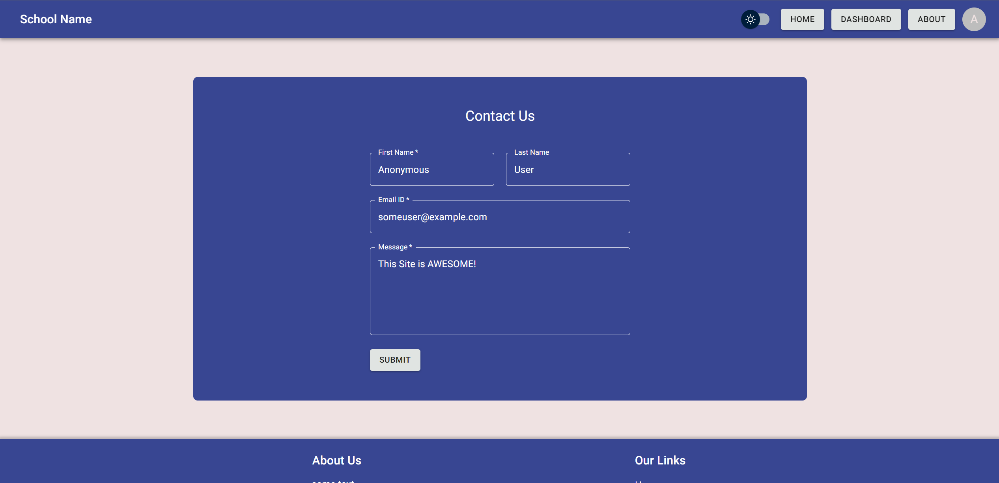
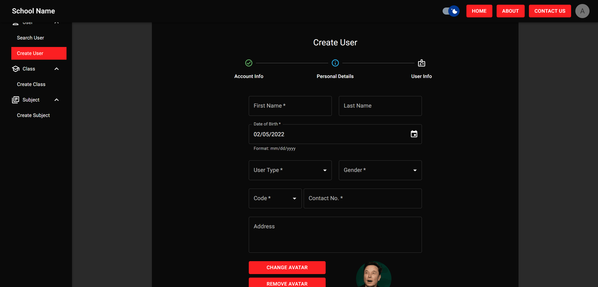
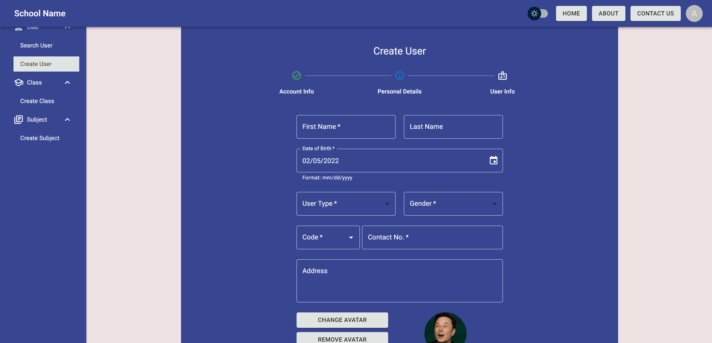
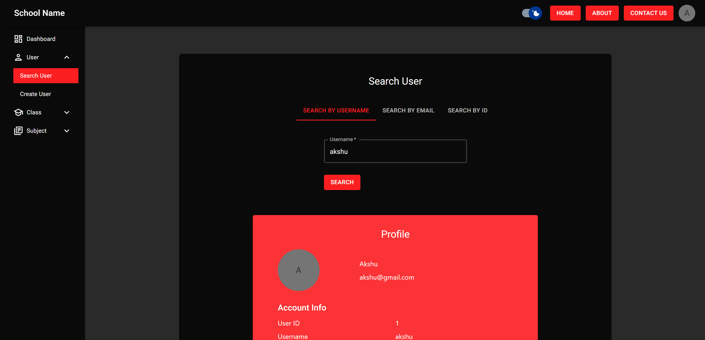
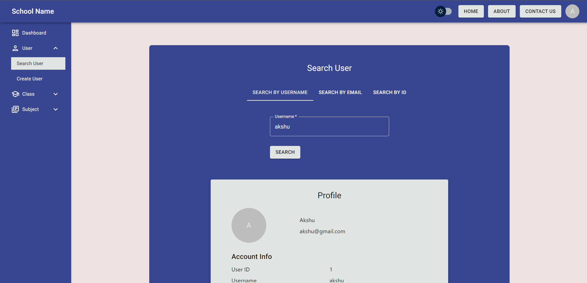
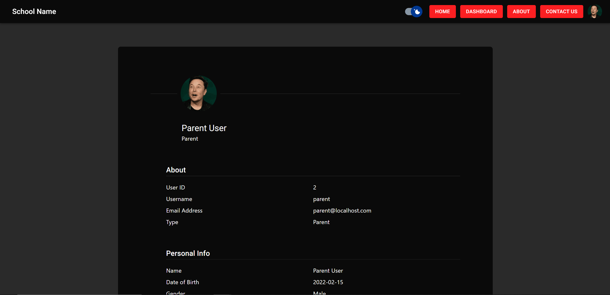

# School Management System

### A Django + Next.js powered School Managament Web Application System equipped with various features!

<br>

> Status: **Paused Development**

> The site isn't 100% ready to be used practically (neither it is recommended to do so) but still works just fine. It is an educational project and is not meant to be used in production (unless you know what you're doing). I have to pause (or maybe stop?) it's development due to examinations, and since it was an assignment, I'll have to submit it now anyways. There are some known (minor) bugs to be fixed later but most of the site is still operable.

<br>
<hr>


## Table of Contents

- [Features](#features)
- [Preview](#preview)
- [Requirements](#requirements)
- [Setup Guide](#setup-guide)
- [How to Setup Credentials](#how-to-setup-credentials)
- [Generating Sample Data](#generating-sample-data)
- [Using pip as the package manager](#using-pip-as-the-package-manager)

<br>
<hr>

## Features

- Secure
- REST API based
- Optimized for performance
- JWT Authentication System with Refresh Tokens
- Supports both MySQL and PostgreSQL
- Light + Dark Mode
- Student, Teacher, Management and Admin Dashboard
- Create Users, Classes, Subjects, Assignments
- Uses (mostly) Material UI
- ... and a lot more!

<br>
<hr>

## Preview

<details>
  <summary>Click to expand</summary>
  <br>

  > There are more images than the ones mentioned here, and even more features than images! These are some of the preview images of how the site looks. Check out more in the [images directory](./images) of the project.

  <br>

  ## Home Page
  

  <br>

  ## Contact Us
  

  

  <br>

  ## Admin Dashboard - Create User
  

  

  <br>

  ## Admin Dashboard - Search User
  

  

  <br>

  ## Profile Page
  

</details>

<br>
<hr>

## Requirements

- Python 3.9 or above
- Node.js 16 or above
- PostgreSQL 13 or above (or MySQL 8.0 or above)
- Redis 3.0 or above

> The project is originally created on software versions listed above and is not tested on other versions. So there might be chances that the project also works fine with different versions.

<br>
<hr>

## Setup Guide

- Install and setup [Redis](https://redis.io/) and [PostgreSQL](https://www.postgresql.org/) (or [MySQL](https://www.mysql.com/)).

- The project uses [Poetry](https://python-poetry.org/) as the default package manager, so it is recommended to have poetry installed in your system. In case you prefer to use [Pip](https://pypi.org/project/pip/) instead of poetry, refer to [Using pip as the package manager](#using-pip-as-the-package-manager).

- Git clone the repository and switch the current directory to the project directory

    ```bat
    git clone https://github.com/AkshuAgarwal/SchoolManagementSystem
    cd SchoolManagementSystem
    ```

- Install the required Packages:
    - Python:

        ```bat
        poetry install
        ```

        > **[Windows]**: In case the ValueError occurs while installing the packages, you can try deleting the `AppData\Local\pypoetry\Cache\artifacts` directory and retry installation. More Info <sup>[Github Issue](https://github.com/python-poetry/poetry/issues/4479) / [StackOverflow Answer](https://stackoverflow.com/a/69425375)</sup>

        > Refer to [Using pip as the package manager](#using-pip-as-the-package-manager) to setup using pip instead.

    - Node.js:

        ```bat
        npm install
        ```

- Setup Credentials and Variables:
    - Rename [`.env.example`](./.env.example) to `.env`.

    - Rename [`constants.json.example`](./constants.json.example) to `constants.json`.

    - Fill all the credentials and values accordingly. (Refer to [How to setup Credentials](#how-to-setup-credentials) for detailed guide).

- Setup Database
    - Run the given command to migrate the database to create required tables:

        ```bat
        poetry run python manage.py migrate
        ```

- Create Super User:
    > Note: If you just want to test the site, you can instead generate some pseudo data by using `generatesampledata` command. Refer to [Generating Sample Data](#generating-sample-data) for a detailed guide.

    > Or if you're running the site in production, you should create some superusers beforehand to access the site and admin panel, using the guide below:

    - To create one, run:

        ```bat
        poetry run python manage.py createsuperuser
        ```
    
        or (if using pip):
    
        ```bat
        # Unix/macOS
        python manage.py createsuperuser

        # Windows
        py manage.py createsuperuser
        ```

        and fill the fields accordingly.

- Start the project:
    - Start Redis Server on the given url listed in `.env`.

    - Make sure the PostgreSQL/MySQL server is running on the same credentials mentioned in `.env`.

    - Open a terminal and start the Django server:

        ```bat
        poetry run python manage.py runserver
        ```

        or (if using pip):

        ```bat
        # Unix/macOS
        python manage.py runserver

        # Windows
        py manage.py runserver
        ```

    - Open another terminal and start Next App:

        ```bat
        npm run dev
        ```

        To run the server on custom port, add the port number with argument `-p`, like:
        ```bat
        npm run dev -p 8080
        ```

        The default port is `3000`.

    - And your site is ready to go 🚀

> You don't need to take care of creating .venv yourself! Poetry automatically creates a venv in your project directory. If you're using pip instead of poetry, you may need to refer to [Using pip as the package manager](#using-pip-as-the-package-manager) for handling `.venv` creation and usage.

> You don't need to take care of creating any required directories by yourself. Django automatically checks for the required directories and creates them (if missing).

<br>
<hr>

## How to Setup Credentials

- ### .env
    - **PRODUCTION** - Whether to run the server in Production (`true`) or in Development (`false`)

    - **DJANGO_SECRET_KEY** - A Secret key used by Django.

        To generate one, run:
        ```bat
        poetry run python manage.py generatesecretkey
        ```
        or (if using pip):
        ```bat
        # Unix/macOS
        python manage.py generatesecretkey

        # Windows
        py manage.py generatesecretkey
        ```
        and copy-paste the key. You can also create a strong secret key yourself!

        > Note that this key is generated by Django automatically. For production, you should create your own secret key instead of using this command.

    - **DJANGO_PROTOCOL** - Protocol to run the Django Server on (`http`/`https`)

    - **DJANGO_HOSTNAME** - Host Name to run the Django Server on

    - **DJANGO_PORT** - Port to run the Django Server on

    - **[ALLOWED_HOSTS](https://docs.djangoproject.com/en/4.0/ref/settings/#allowed-hosts)** - Django's ALLOWED_HOSTS Setting. For setting multiple values, separate every item by a comma. Example: `".localhost,127.0.0.1,[::1]"`

    - **[CORS_ALLOWED_ORIGINS](https://github.com/adamchainz/django-cors-headers#cors_allowed_origins-sequencestr)** - Django Cors Headers CORS_ALLOWED_ORIGINS setting. For setting multiple values, separate every item by a comma. Example: `"http://127.0.0.1:3000,http://localhost:3000"`

    - **[CSRF_TRUSTED_ORIGINS](https://docs.djangoproject.com/en/4.0/ref/settings/#csrf-trusted-origins)** - Django's CSRF_TRUSTED_ORIGINS setting. For setting multiple values, separate every item by a comma. Example: `"http://127.0.0.1:3000,http://localhost:3000"`

    - **ANALYZE** - **[Development Only]** Enables the `@next/bundle-analyzer` to analyze bundle size. (`true`/`false`)

    - **SITE_URL** - URL of the frontend site

    - **DB_ENGINE** - Database Engine to use (`mysql`/`postgresql`)

    - **DB_HOST** - Database Host Name

    - **DB_PORT** - Database Port

    - **DB_USER** - Database User

    - **DB_PASS** - Database Password

    - **DB_NAME** - Database Name

    - **REDIS_URL** - URL on which the redis server is running

    - **EMAIL_CONNECTION** - Connection to use when talking to SMTP server. (`tls`/`ssl`). More Info <sup>[tls](https://docs.djangoproject.com/en/4.0/ref/settings/#email-use-tls) / [ssl](https://docs.djangoproject.com/en/4.0/ref/settings/#email-use-ssl)</sup>

    - **[FROM_EMAIL](https://docs.djangoproject.com/en/4.0/ref/settings/#default-from-email)** - Default email address to use for various automated correspondence from the site manager(s).

    - **[EMAIL_HOST](https://docs.djangoproject.com/en/4.0/ref/settings/#email-host)** - Host to use for sending the email

    - **[EMAIL_PORT](https://docs.djangoproject.com/en/4.0/ref/settings/#email-port)** - Port the use for the SMTP server

    - **[EMAIL_HOST_USER](https://docs.djangoproject.com/en/4.0/ref/settings/#email-host-user)** - Username to use for the SMTP server

    - **[EMAIL_HOST_PASSWORD](https://docs.djangoproject.com/en/4.0/ref/settings/#email-host-password)** - Password to use for the SMTP server

    - **[EMAIL_SUBJECT_PREFIX](https://docs.djangoproject.com/en/4.0/ref/settings/#email-subject-prefix)** - Subject-line prefix for email messages sent with `django.core.mail.mail_admins` or `django.core.mail.mail_managers`. You’ll probably want to include the trailing space

- ### constants.json
    - **SCHOOL_NAME** - Name of the School (will be displayed in Frontend)

    - **[TIME_ZONE](https://docs.djangoproject.com/en/4.0/ref/settings/#time-zone)** - Time Zone for Django

    - **[PASSWORD_RESET_TIMEOUT](https://docs.djangoproject.com/en/4.0/ref/settings/#password-reset-timeout)** - No. of seconds the Password Reset Link will be valid for

    - **FOOTER_TEXT** - Text to be displayed in Footer (in frontend)

<br>
<hr>

## Generating Sample Data
- If you want to test the site, you may need to have some data preloaded in your database for most features of the site to work. Creating every set of data manually might be a hassle and time-consuming. For this, the application comes with a command to help you generate some minimal required data automatically!

- To generate the data, run:

    ```bat
    poetry run python manage.py generatesampledata
    ```

    or (if using pip):

    ```bat
    # Unix/macOS
    python manage.py generatesampledata

    # Windows
    py manage.py generatesampledata
    ```

    and it'll automatically load the data into the database without any hassle!

<br>

> Note: You must use a newly created database and not run this command twice with the same database as it may cause data collisions and improper data.

<br>

> You can use the credentials from the tables below to log into and operate the site.

The data generated by the command (Click to expand):

<details>
<summary>Users</summary>

<br>

<details>
<summary>Admin</summary>

<br>

| S. No. | Username | First Name | Last Name | Email ID              | User Type | Date of Birth | Gender | Contact No.   | Password   |
| ------ | -------- | ---------- | --------- | --------------------- | --------- | ------------- | ------ | ------------- | ---------- |
| 1      | admin_1  | Admin (1)  | User      | admin_1@localhost.com | Admin     | 1970-01-01    | Male   | +123456789011 | AUser1@123 |
| 2      | admin_2  | Admin (2)  | User      | admin_2@localhost.com | Admin     | 1970-01-02    | Female | +123456789012 | AUser2@123 |

</details>

<details>
<summary>Parent</summary>

<br>

| S. No. | Username | First Name | Last Name | Email ID               | User Type | Date of Birth | Gender | Contact No.   | Password   |
| ------ | -------- | ---------- | --------- | ---------------------- | --------- | ------------- | ------ | ------------- | ---------- |
| 3      | parent_1 | Parent (1) | User      | parent_1@localhost.com | Parent    | 1970-01-03    | Male   | +123456789021 | PUser1@123 |
| 4      | parent_2 | Parent (2) | User      | parent_2@localhost.com | Parent    | 1970-01-04    | Female | +123456789022 | PUser2@123 |
| 5      | parent_3 | Parent (3) | User      | parent_3@locahost.com  | Parent    | 1970-01-05    | Male   | +123456789023 | PUser3@123 |

</details>

<details>
<summary>Student</summary>

<br>

| S. No. | Username  | First Name  | Last Name | Email ID                | User Type | Date of Birth | Gender | Contact No.   | Password   | Parent's Username | Grade ID | Roll No. | Year of Enroll | Fee   |
| ------ | --------- | ----------- | --------- | ----------------------- | --------- | ------------- | ------ | ------------- | ---------- | ----------------- | -------- | -------- | -------------- | ----- |
| 6      | student_1 | Student (1) | User      | student_1@localhost.com | Student   | 1970-01-06    | Female | +123456789031 | SUser1@123 | parent_1          | 1        | 1        | 2020           | 10000 |
| 7      | student_2 | Student (2) | User      | student_2@localhost.com | Student   | 1970-01-07    | Male   | +123456789032 | SUser2@123 | parent_1          | 10       | 2        | 2010           | 20000 |
| 8      | student_3 | Student (3) | User      | student_3@localhost.com | Student   | 1970-01-08    | Female | +123456789033 | SUser3@123 | parent_2          | 45       | 1        | 2015           | 25000 |

</details>

<details>
<summary>Teacher</summary>

<br>

| S. No. | Username  | First Name  | Last Name | Email ID                | User Type | Date of Birth | Gender | Contact No.   | Password   | Subject ID | Year of Joining | Salary | Classes IDs                    | Owns Class ID |
| ------ | --------- | ----------- | --------- | ----------------------- | --------- | ------------- | ------ | ------------- | ---------- | ---------- | --------------- | ------ | ------------------------------ | ------------- |
| 9      | teacher_1 | Teacher (1) | User      | teacher_1@localhost.com | Teacher   | 1970-01-09    | Male   | +123456789041 | TUser1@123 | 1          | 2010            | 10000  | 1, 2, 3, 4                     | 4             |
| 10     | teacher_2 | Teacher (2) | User      | teacher_2@localhost.com | Teacher   | 1970-01-10    | Female | +123456789042 | TUser2@123 | 5          | 2015            | 30000  | 21, 22, 23, 24, 31, 32, 40, 41 | 22            |
| 11     | teacher_3 | Teacher (3) | User      | teacher_3@localhost.com | Teacher   | 1970-01-11    | Male   | +123456789043 | TUser3@123 | 6          | 2016            | 75000  | 44, 45, 46, 47, 48, 10, 12, 14 | 45            |

</details>

<details>
<summary>Management</summary>

<br>

| S. No. | Username     | First Name     | Last Name | Email ID                   | User Type  | Date of Birth | Gender | Contact No.   | Password   | Year of Joining | Salary  | Role                |
| ------ | ------------ | -------------- | --------- | -------------------------- | ---------- | ------------- | ------ | ------------- | ---------- | --------------- | ------- | ------------------- |
| 12     | management_1 | Management (1) | User      | management_1@localhost.com | Management | 1970-01-12    | Female | +123456789051 | MUser1@123 | 1990            | 1000000 | Receptionist        |
| 13     | management_2 | Management (2) | User      | management_2@localhost.com | Management | 1970-01-13    | Male   | +123456789052 | MUser2@123 | 2000            | 50000   | Counsellor          |
| 14     | management_3 | Management (3) | User      | management_3@localhost.com | Management | 1970-01-14    | Female | +123456789053 | MUser3@123 | 1980            | 78000   | Accountancy Manager |

</details>

</details>


<details>
<summary>Classes</summary>

<br>

| S. No. | Grade | Section |
| ------ | ----- | ------- |
| 1      | 1     | A       |
| 2      | 1     | B       |
| 3      | 1     | C       |
| 4      | 1     | D       |
| 5      | 2     | A       |
| 6      | 2     | B       |
| 7      | 2     | C       |
| 8      | 2     | D       |
| 9      | 3     | A       |
| 10     | 3     | B       |
| 11     | 3     | C       |
| 12     | 3     | D       |
| 13     | 4     | A       |
| 14     | 4     | B       |
| 15     | 4     | C       |
| 16     | 4     | D       |
| 17     | 5     | A       |
| 18     | 5     | B       |
| 19     | 5     | C       |
| 20     | 5     | D       |
| 21     | 6     | A       |
| 22     | 6     | B       |
| 23     | 6     | C       |
| 24     | 6     | D       |
| 25     | 7     | A       |
| 26     | 7     | B       |
| 27     | 7     | C       |
| 28     | 7     | D       |
| 29     | 8     | A       |
| 30     | 8     | B       |
| 31     | 8     | C       |
| 32     | 8     | D       |
| 33     | 9     | A       |
| 34     | 9     | B       |
| 35     | 9     | C       |
| 36     | 9     | D       |
| 37     | 10    | A       |
| 38     | 10    | B       |
| 39     | 10    | C       |
| 40     | 10    | D       |
| 41     | 11    | PCM     |
| 42     | 11    | PCB     |
| 43     | 11    | Com.    |
| 44     | 11    | Hum.    |
| 45     | 12    | PCM     |
| 46     | 12    | PCB     |
| 47     | 12    | Com.    |
| 48     | 12    | Hum.    |

</details>

<details>
<summary>Subjects</summary>

<br>

| S. No. | Name                  | Code |
| ------ | --------------------- | ---- |
| 1      | Science               | 1    |
| 2      | Mathematics           | 2    |
| 3      | Physics               | 3    |
| 4      | Chemistry             | 4    |
| 5      | Biology               | 5    |
| 6      | Social Science        | 6    |
| 7      | History               | 7    |
| 8      | Geography             | 8    |
| 9      | Political Science     | 9    |
| 10     | Economics             | 10   |
| 11     | Accountancy           | 11   |
| 12     | Business Studies      | 12   |
| 13     | Hindi                 | 13   |
| 14     | English               | 14   |
| 15     | French                | 15   |
| 16     | Information Practices | 16   |

</details>

<details>
<summary>Assignments</summary>

<br>

| S. No. | Title        | Assigned By ID | Assigned To ID   | Submission Date | File Path                                    | Message                       |
| ------ | ------------ | -------------- | ---------------- | --------------- | -------------------------------------------- | ----------------------------- |
| 1      | Assignment 1 | 9              | 1, 2, 6          | 1970-01-01      | [SampleData/file.txt](./SampleData/file.txt) | This is the First Assignment  |
| 2      | Assignment 2 | 10             | 2, 4             | 1970-01-02      | [SampleData/file.txt](./SampleData/file.txt) | This is the Second Assignment |
| 3      | Assignment 3 | 11             | 5                | 1970-01-01      | [SampleData/file.txt](./SampleData/file.txt) | This is the Third Assignment  |
| 4      | Assignment 4 | 9              | 10               | 1970-01-01      | [SampleData/file.txt](./SampleData/file.txt) | This is the Fourth Assignment |
| 5      | Assignment 5 | 10             | 45, 46           | 1970-01-04      | [SampleData/file.txt](./SampleData/file.txt) | This is the Fifth Assignment  |
| 6      | Assignment 6 | 11             | 46, 48           | 1970-01-01      | [SampleData/file.txt](./SampleData/file.txt) | This is the Sixth Assignment  |

</details>

<br>
<hr>

## Using pip as the package manager

- Pip by default does not create a virtual environment. If you're planning to use pip, you'll have to create it by yourself.

- To create one, run the following command:

    ```bat
    # Unix/macOS
    python -m venv .venv

    # Windoes
    py -m venv .venv
    ```

    This will create a folder named `.venv` in your project root directory.

- Activate the virtual environment using:

    ```bat
    # Unix/macOS
    source ./.venv/bin/activate
    
    # Windows
    .venv\Scripts\activate

    ```
    > To exit the environment, just type `deactivate`.
    
    After successfully installing and activating venv, you can now install the packages.

- The project also comes with `requirements.txt` (and `requirements.dev.txt` for dev dependencies) by which you can install the packages. To install, just run:

    ```bat
    pip install -r requirements.txt
    ```

- You have successfully installed packages using pip.

> Note that to run any command mentioned above with poetry, you must activate the venv first and then directly use `python` or `py` to run scripts.
